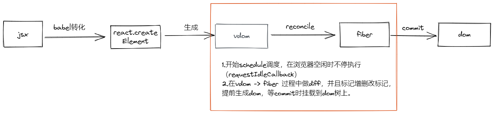

# 总览

## 1.react v16之前

### render

递归生成dom树

### patch
  
1. 将新的vdom和已有的dom做diff
2. 如果组件不同，直接替换掉
3. 如果是组件相同、则继续比较子节点

***
## 为什么需要fiber呢？

Diff一旦开始就无法中止（中止会导致数据无法恢复）  
而浏览器的刷新频率是60HZ，也就是16.6ms（1000ms/60）   
如果项目很大，会导致js执行超过16.6ms，那么就会阻塞页面的渲染，从而出现卡顿现象，也就是常说的掉帧！

> 一帧时间内，浏览器要做这么多事情

***

## 2.react v16之后

### render

1. 将vdom组装成fiber的props.children，放入nextUnitOfWork中

### workLoop

#### reconcileChildren

1. 不断检查nextUnitOfWork是否有需要渲染的fiber  
2. 不断将vdom转化成fiber，每次只转化一个节点的所有子节点  
3. 转化过程中将vdom与旧fiber对比，并且标记差异，提前生成dom节点  
4. 转化完毕后，将下一个待执行的fiber节点赋值给nextUnitOfWork，返回nextUnitOfWork

#### commitRoot

1. 遍历fiber，根据对应的标记将提前生成的dom节点，组装到dom树上
